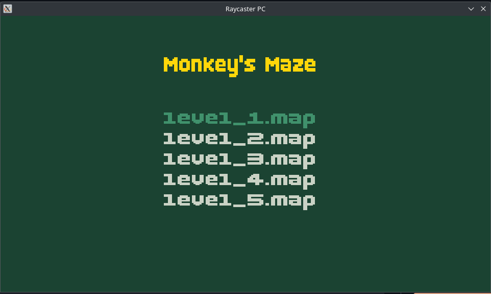
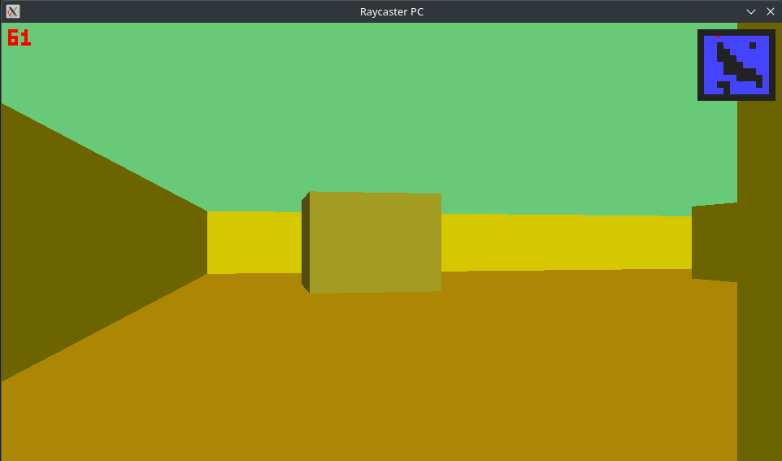

# Gráficas por Computadora - Proyecto 1
## Raycasting
Ana Laura Tschen 221645

### Descripción


### Tecnologías
[](https://skillicons.dev)

### Como jugar?
+ Para jugar en PC es necesario tener instalado rust y las dependencis necesarias. Se puede clonar el repositorio y compilar con ``` cargo build -p raycaster-pc ``` y luego correr con ``` cargo run -p raycaster-pc --release -- levels/level1.map``` .
+ Para jugar en kindle ....

### Screenshots

