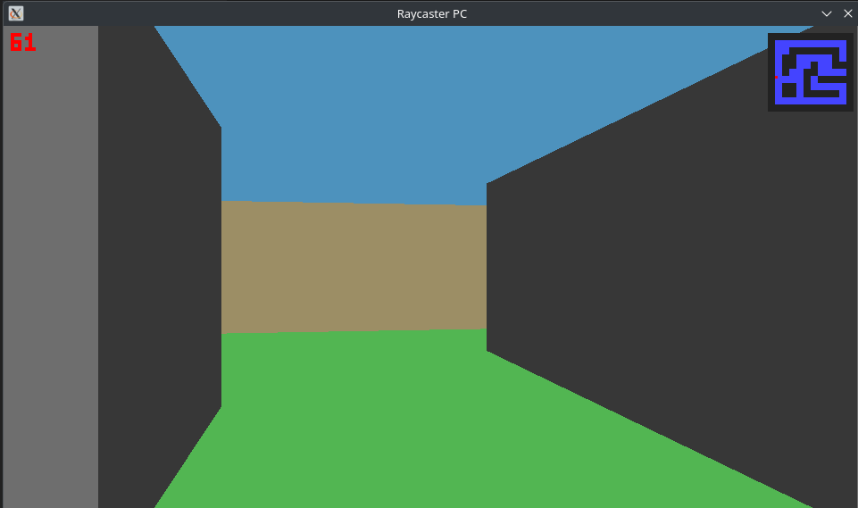
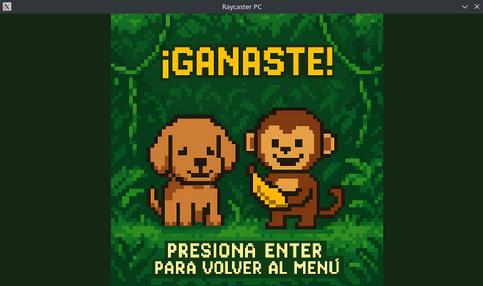

# Gráficas por Computadora - Proyecto 1
## Raycasting - Monkey's Maze
Ana Laura Tschen 221645

### Descripción
Este proyecto consiste en un Ray Caster Simple utilizando Rust. El proyecto permite que el jugador pueda seleccionar distintos niveles de laberintos en los que debe encontrar la meta.

### Tecnologías
[](https://skillicons.dev)

### Como jugar?
+ Para jugar en PC es necesario tener instalado rust y las dependencis necesarias. Se puede clonar el repositorio y compilar con ``` cargo build -p raycaster-pc ``` y luego correr con ``` cargo run -p raycaster-pc --release   ``` .

+ Para poder seleccionar un nivel, se utilizan las flechas de *up*, *down* y *enter*.

+ Para moverse en el mapa se utilizan las siguientes teclas:
    + *w* - para moverse hacia adelante
    + *s* - para moverse hacia atras
    + *a* - para moverse hacia la izquierda
    + *d*  - para moverse hacia la derecha
+ Para rotar la vista se pueden utilizar tanto las flechas de la derecha e izquiera y el mouse (solamente es rotación horizontal).

### Link al demo del juego
+ [Link de Youtube](https://youtu.be/HDjWqsMVWtw)


### Screenshots






### Créditos
+ [Musica de fondo](https://opengameart.org/)

+ [Shake It Off - Taylor Swift](https://youtu.be/H59xVMF4zxE?si=Pd4if9VQqbHudZz0)